# PatchCore 入門講義
### 〜 正常データだけで「どこがおかしいか」を見つける異常検知 〜

> 参考論文: K. Roth et al., *"Towards Total Recall in Industrial Anomaly Detection"*, CVPR 2022

---

## この講義の見取り図

**到達目標**：受講後に「正常パッチの辞書を作る」「代表例を選ぶ」「距離を異常度にする」を、自分の言葉と図で説明できる。

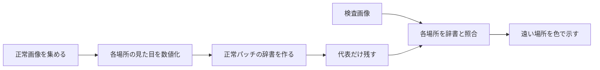

> **最初のたとえ**：辞書に「正常なネジの頭」「正常な金属表面」などの見た目を登録する。検査画像の各場所を辞書で引き、似た項目が見つからない場所を異常候補とする。実際の辞書は単語ではなく特徴ベクトルを保存する。

---

## 目次

1. 背景：産業向け異常検知の難しさ
2. PatchCore の全体像
3. Step 1：パッチ特徴の抽出
4. Step 2：メモリバンクの構築
5. Step 3：Coreset サブサンプリング
6. Step 4：推論（異常スコアと異常マップ）
7. ライブラリ（anomalib）で試す
8. 性能・長所・短所
9. まとめ
10. 演習問題

---

## 1. 背景：産業向け異常検知の難しさ

製造ラインの外観検査では、次のような制約があります。

| 課題 | 内容 |
|---|---|
| 異常データが少ない | 不良品はめったに出ない。種類も予測できない |
| 異常の種類が未知 | 傷・汚れ・欠け・異物…学習時に見たことのない不良も検出したい |
| 位置も知りたい | 「不良かどうか」だけでなく「どこが不良か」を示したい |

➡ そこで **「正常品の画像だけ」で学習** し、正常から外れたものを異常とみなす
**One-Class（教師なし）異常検知** のアプローチを取ります。

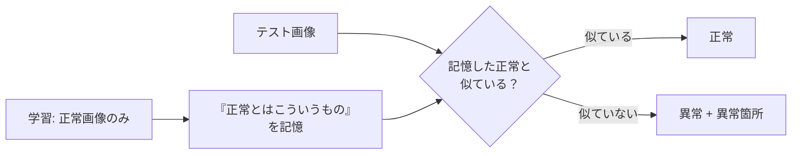

### 図解：画像全体ではなく「場所ごと」に照合する

以下は説明用の **4×4 の位置グリッド**。実際の224×224入力の例では、特徴マップは28×28、つまり784位置になる。

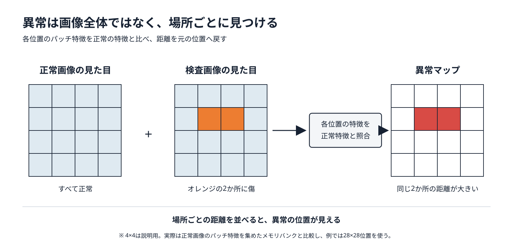

**問いかけ**：傷の場所が分かるのはなぜか？　→ 比較と採点を画像単位ではなく、各位置の特徴ごとに行い、そのスコアを元の位置へ戻すため。

### 代表的な先行手法との関係

| 手法 | アイデア | 課題 |
|---|---|---|
| SPADE (2020) | 画像全体の特徴で kNN → 画素特徴で位置推定 | 推論が遅い |
| PaDiM (2020) | パッチ位置ごとにガウス分布を当てはめる | 位置ずれに弱い／共分散計算が重い |
| **PatchCore (2022)** | **全パッチ特徴をメモリに保存し最近傍探索**、Coreset で軽量化 | メモリ量（→Coreset で緩和） |

---

## 2. PatchCore の全体像

**ポイントは「学習（パラメータ更新）をしない」こと。**
ImageNet で事前学習済みの CNN をそのまま特徴抽出器として使い、
正常画像のパッチ特徴を「メモリバンク」に貯めるだけです。

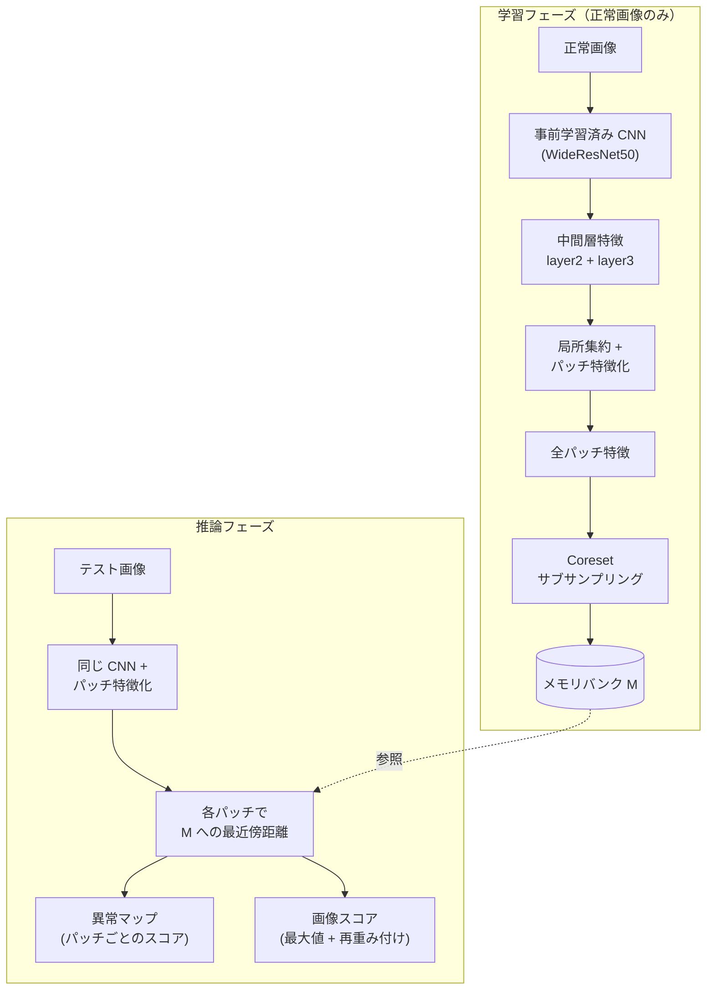

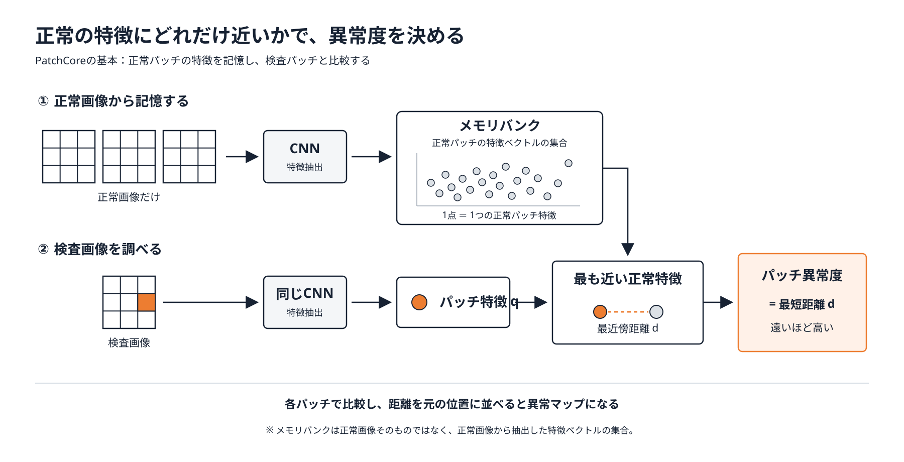

図中の散布図は、高次元の特徴ベクトル同士の近さを2次元に置き換えた模式図です。

覚えておくべき 3 つのキーワード：

1. **Locally aware patch features**（局所情報を含むパッチ特徴）
2. **Memory bank**（正常パッチ特徴の辞書）
3. **Coreset subsampling**（メモリバンクの代表点だけ残す）

---

## 3. Step 1：パッチ特徴の抽出

### まず「パッチ特徴」とは？

画像を小さな領域ごとに調べ、**その場所の見た目を数字の列（ベクトル）で表したもの**です。ただし、ここでいうパッチは「元画像を28×28枚に切り出した小画像」そのものではありません。CNN の**特徴マップ上の1位置**が、元画像のある範囲を見て得た情報に対応します。隣の位置が見る範囲は重なります。

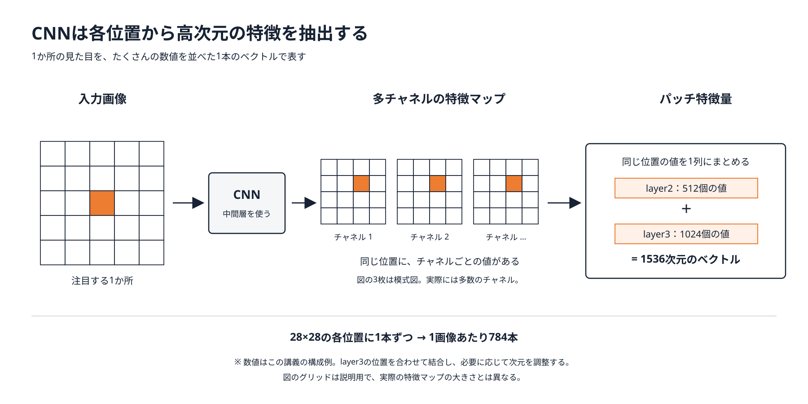

**実際の特徴量は高次元です。** CNNは各位置について数百〜数千個の値を抽出します。この講義の例では、`layer2` の512個と`layer3` の1024個を結合すると1位置あたり1536次元になり、必要に応じて1024次元に調整します。図の短いベクトルや2次元の散布図は、見やすくするための模式表現です。

たとえば特徴マップの中央に対応するベクトルには、その場所の色や模様、周囲の形に関する情報が入ります。推論時には、その1本を正常画像から集めたベクトルと比べます。

### 3.1 なぜ「中間層」を使うのか

```
入力画像 → [layer1] → [layer2] → [layer3] → [layer4] → 分類ヘッド
            低レベル     ↑中レベル↑    ↑中レベル↑    高レベル
            (エッジ等)   ここを使う！               (ImageNet の
                                                   クラスに偏る)
```

- **浅い層**：エッジや色など汎用的すぎる
- **深い層**：ImageNet の分類タスクに特化しすぎ、解像度も低い
- **中間層（layer2, layer3）**：テクスチャや形状など、異常検知にちょうど良い情報

### 3.2 テンソル形状の流れ（入力 224×224, WideResNet50 の場合）

まず **1枚の画像（$B=1$）** として読むと、`(チャネル数, 高さ, 幅)` です。チャネルは「同じ位置を異なる見方で表した特徴の種類」、28×28 は位置の数です。

| 段階 | 形 | 何をしているか |
|---|---|---|
| `layer2` | `512 × 28 × 28` | 細かめの模様・形を28×28の位置に記録 |
| `layer3` | `1024 × 14 × 14` | 広めの範囲の形を14×14の位置に記録 |
| 位置合わせ | `1024 × 28 × 28` | `layer3` を拡大し、`layer2` と位置を合わせる |
| 結合 | `1536 × 28 × 28` | 各位置で512個と1024個の値をつなぐ |
| 次元削減・並べ替え | `784 × 1024` | 28×28個の位置を、1024次元のベクトル784本にする |

**位置合わせは画像を鮮明にする処理ではありません。** 14×14の特徴を28×28の位置に対応付け、同じ場所の`layer2`特徴と結合するために行います。

```
入力 x           : (B,    3, 224, 224)
layer2 出力      : (B,  512,  28,  28)
layer3 出力      : (B, 1024,  14,  14)
        │
        │ ① 局所集約（3×3 平均プーリング, stride=1）→ 周辺パッチの文脈を取り込む
        │ ② layer3 を 28×28 にアップサンプリング
        │ ③ チャネル方向に結合
        ▼
結合特徴         : (B, 1536,  28,  28)
        │ ④ 次元削減（1536 → 1024）
        ▼
パッチ特徴       : (B × 28 × 28, 1024)   ← 1 画像あたり 784 個のパッチ特徴
```

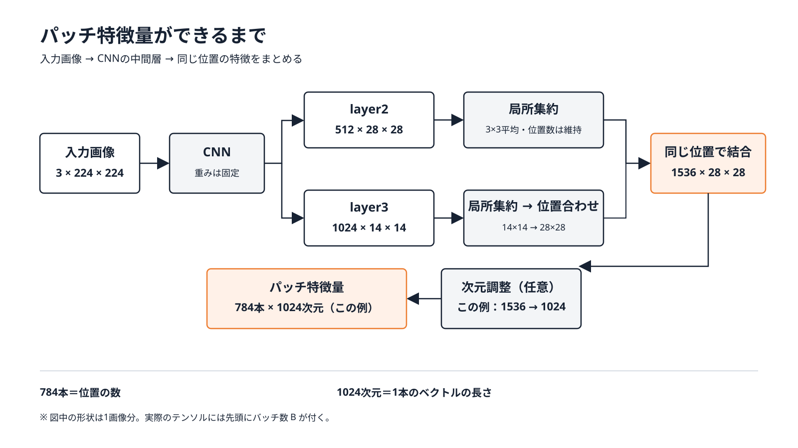

※ 次元削減は必須ではありません。省略して1536次元のまま各パッチを保存する構成も可能です。この図と以下の数値は1024次元にする講義用の例です。

ここでの「次元削減」は**1本のベクトルの長さ**を1536から1024にする処理です。**ベクトルの本数**784は変わりません。

**見方**：`28 × 28 = 784` はベクトルの**本数**。`1536 → 1024` は各ベクトルの**長さ**。位置合わせは `layer2` と `layer3` の同じ場所を結ぶために行う。

### 3.3 局所集約（Local neighborhood aggregation）

特徴マップの 1 点 $(h, w)$ について、その周辺 $p \times p$ 近傍の特徴を平均します。

たとえば中央の位置が持つ値だけを使う代わりに、周囲8位置も合わせた3×3の平均を使います。処理後も特徴マップの縦横は28×28のままです。つまり、**784本の特徴の本数を減らすプーリングではありません**。

$$
\phi_{h,w} = \frac{1}{p^2} \sum_{(a,b) \in \mathcal{N}_p(h,w)} f_{a,b}
$$

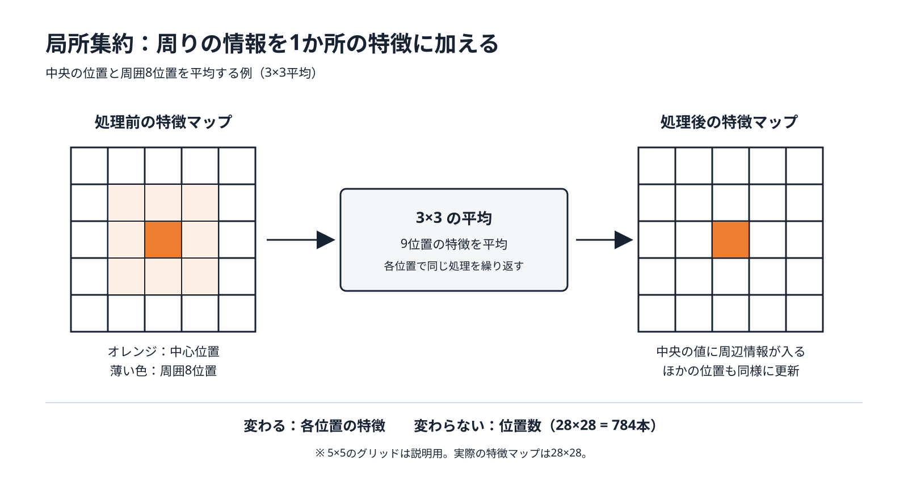

**効果**：受容野（見ている範囲）が少し広がり、位置ずれやノイズに頑健になる。
しかも CNN をさらに深くするわけではないので、特徴が ImageNet に偏りすぎない。

---

## 4. Step 2：メモリバンクの構築

正常画像 $N$ 枚すべてのパッチ特徴を 1 つの集合にまとめます。

$$
\mathcal{M} = \bigcup_{x_i \in \mathcal{X}_{\text{train}}} \mathcal{P}(\phi(x_i))
$$

```
正常画像 1 → 784 個のパッチ特徴 ┐
正常画像 2 → 784 個のパッチ特徴 ├─▶ メモリバンク M
   ...                          │    (例: 200 枚 × 784 = 156,800 個 × 1024 次元)
正常画像 N → 784 個のパッチ特徴 ┘
```

- 画像全体ではなく **パッチ単位** で保存するのがミソ
  → 「この部分は、どの正常画像のどこかに似たパッチがあるか？」で判定できる
- PaDiM と違い **位置情報を捨てている** ので、物体の位置ずれに強い

⚠ 問題点：このままだと **メモリも推論時間も膨大**（最近傍探索が $O(|\mathcal{M}|)$）

---

## 5. Step 3：Coreset サブサンプリング

### 5.1 アイデア

メモリバンクから **「全体をよくカバーする少数の代表点」** だけを選びます。
ランダムに間引くと、まれな正常パターン（端の方の点）が消えてしまいがちです。

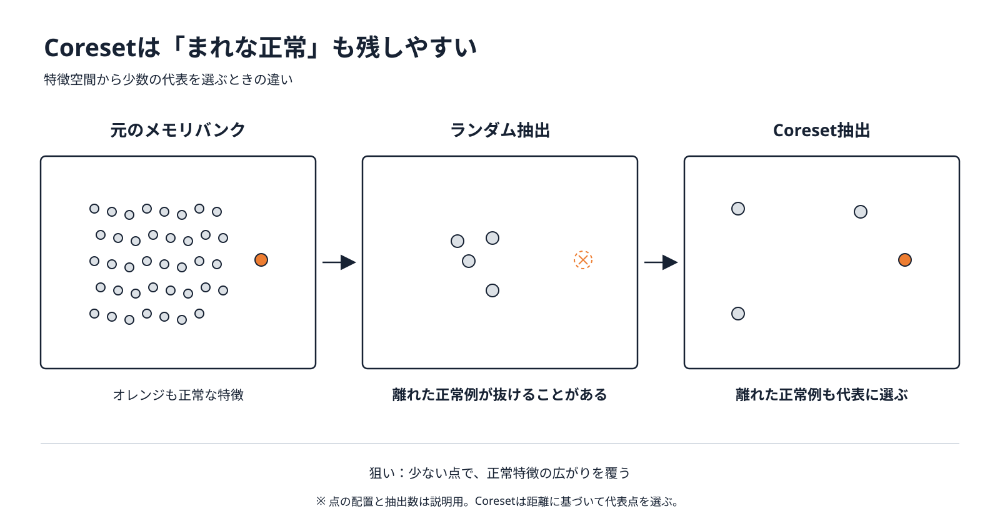

### 図解：Coreset が守る「まれな正常」

次の表は、特徴空間にある正常パッチを単純化した例。数字は位置ではなく、見た目の違いを表す座標だと考える。

| 正常パターン | 全データ中の数 | ランダム抽出での扱い | Coreset での扱い |
|---|---:|---|---|
| よくある平らな表面 | 多い | 多数残りやすい | 少数の代表でカバー |
| 端にだけある反射 | 少ない | 消えることがある | 他の代表から遠いため選ばれやすい |
| 正常な細い溝 | 少ない | 消えることがある | 独特な見た目なら選ばれやすい |

**問いかけ**：辞書から「端にある正常な反射」が消えたら？　→ 検査時にその反射を異常と誤判定しやすくなる。

### 5.2 定式化（minimax facility location）

選ばれた集合 $\mathcal{M}_C$ から最も遠い点までの距離を最小化します。

$$
\mathcal{M}_C^{*} = \arg\min_{\mathcal{M}_C \subset \mathcal{M}} \; \max_{m \in \mathcal{M}} \; \min_{n \in \mathcal{M}_C} \| m - n \|_2
$$

これは NP 困難なので、**貪欲法（Greedy k-center）** で近似します。

### 5.3 Greedy k-center アルゴリズム

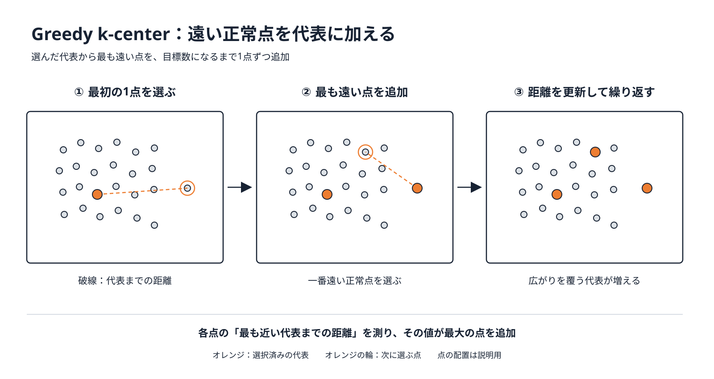

最初に1点を選び、各正常点から**選択済み代表への最短距離**を求めます。その値が最大の点を代表に追加し、目標数まで繰り返します。

**高速化の工夫**：距離計算は **ランダム射影** で 1024 次元 → 128 次元程度に落としてから行う
（Johnson–Lindenstrauss の補題により、距離関係はおおよそ保たれる）。

論文では 1% / 10% / 25% に削減しても性能はほぼ落ちないことが示されています。

---

## 6. Step 4：推論（異常スコアと異常マップ）

### 6.1 パッチごとの異常スコア

テスト画像の各パッチ特徴 $m^{\text{test}}$ について、メモリバンク内の最近傍までの距離を測ります。

$$
s(m^{\text{test}}) = \min_{m \in \mathcal{M}_C} \| m^{\text{test}} - m \|_2
$$

→ これを 28×28 に並べると **異常マップ（パッチ解像度）** になる。

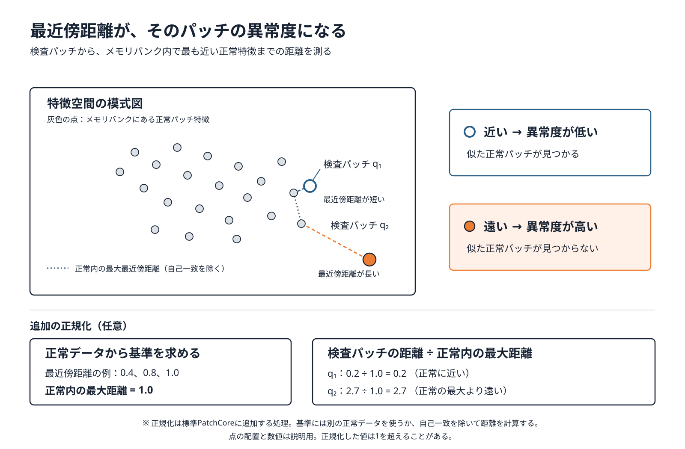

> **追加の正規化（任意）**：正常の校正用パッチについてもメモリバンクへの最近傍距離を計算し、その最大値 $d_{\mathrm{normal,max}}$ を基準に、検査パッチの距離を $s_{\mathrm{norm}}(q)=s(q)/d_{\mathrm{normal,max}}$ と表せます。メモリバンクを作った点をそのまま照合すると自己一致で距離が0になるため、別の正常データを使うか自己一致を除きます。基準が0にならないことも確認します。正規化値は1を超えることがあり、これは標準PatchCoreの必須処理や画像スコアの再重み付けとは別です。

### 図解：最近傍距離の計算を3個だけで追う

正常メモリに特徴ベクトル `A`, `B`, `C` があるとする。検査パッチ `q` からの距離が次のとき、最も似た正常例は `B`。

```text
q ── 0.8 ── A
  ├─ 0.2 ─── B  ← 最近傍
  └──── 1.4 ─ C

パッチ異常スコア = min(0.8, 0.2, 1.4) = 0.2
```

別のパッチ `r` の最短距離が `2.7` なら、`r` の方が異常らしい。この計算を全784位置で行い、28×28に並べ直す。

### 距離から異常マップになるまで：小さな例

下図の数値は説明用です。正常パッチの辞書に似たものがあれば距離は小さく、傷の部分だけ距離が大きくなります。実際には 28×28 個のパッチで同じ計算をします。

| 左 | 中 | 右 |
|---:|---:|---:|
| 0.2 | 0.1 | 0.2 |
| 0.2 | **2.7** | **2.3** |
| 0.1 | 0.3 | 0.2 |

この例では中央と右中が高く、傷がそのあたりにあると読めます。**画像スコア**は最も高い距離を出発点にし、**異常マップ**は各位置の距離を残します。

### 図解：2種類の出力を混同しない

| 出力 | 元になる値 | 答える問い | 使い方 |
|---|---|---|---|
| 画像スコア | 最も高いパッチ距離を再重み付け | この画像は異常か | 閾値で良品・不良品を判定 |
| 異常マップ | 各位置のパッチ距離 | どこが怪しいか | 元画像に重ねて場所を示す |

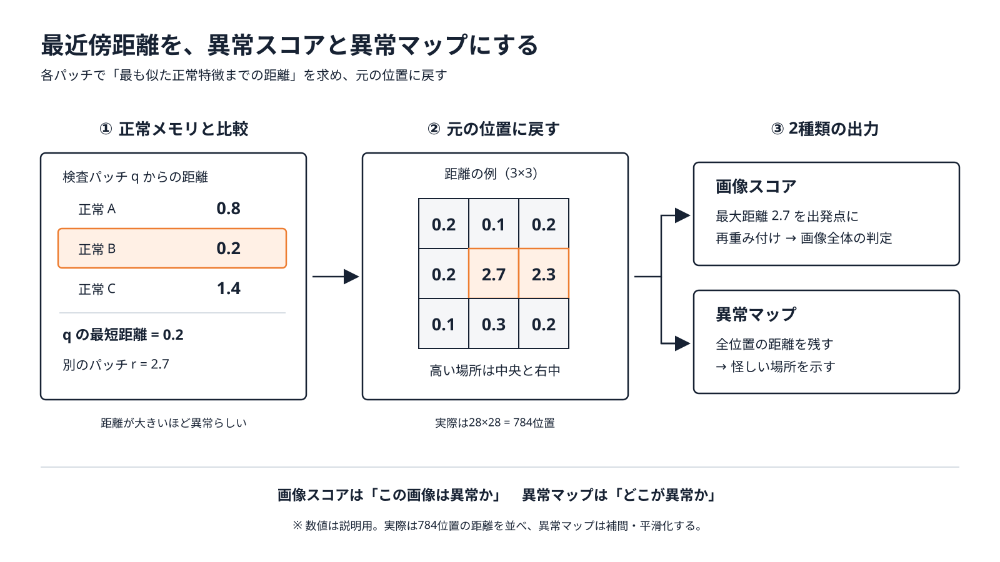

### 6.2 画像単位の異常スコア

1. テスト画像のパッチ特徴集合 $\mathcal{P}_{\text{test}}$ から、最も異常なパッチを見つける

$$
m^{\text{test},*} = \arg\max_{q \in \mathcal{P}_{\text{test}}} s(q), \qquad
m^{*} = \arg\min_{m \in \mathcal{M}_C} \|m^{\text{test},*}-m\|_2, \qquad
s^{*}=s(m^{\text{test},*})
$$

2. **再重み付け**：$m^{*}$ の周辺（メモリ内の近傍 $b$ 個 $\mathcal{N}_b(m^*)$）の状況を考慮する

$$
s = \left( 1 - \frac{\exp \| m^{\text{test},*} - m^{*} \|_2}{\sum_{m \in \mathcal{N}_b(m^{*})} \exp \| m^{\text{test},*} - m \|_2} \right) \cdot s^{*}
$$

**直感的な意味**：最も異常なパッチの最近傍 $m^*$ だけでなく、その周辺の正常特徴との距離も見て画像スコアを調整します。式では、周辺の点もテストパッチに近いと重みは相対的に小さくなり、$m^*$ 以外の周辺点が遠いと重みは大きくなります。これは前節の「正常内の最大最近傍距離で割る」任意の正規化とは別の処理です。

### 6.3 異常マップ（セグメンテーション）

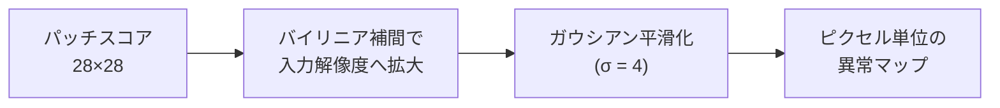

---

## 7. ライブラリ（anomalib）で試す

実務では Intel の OSS [anomalib](https://github.com/open-edge-platform/anomalib) を使うのが手軽です。

```python
from anomalib.data import MVTecAD
from anomalib.engine import Engine
from anomalib.models import Patchcore

datamodule = MVTecAD(category="bottle")
model = Patchcore(
    backbone="wide_resnet50_2",
    layers=["layer2", "layer3"],
    coreset_sampling_ratio=0.1,
    num_neighbors=9,
)

engine = Engine()
engine.fit(model=model, datamodule=datamodule)   # メモリバンク構築（1 エポック）
engine.test(model=model, datamodule=datamodule)  # AUROC 等を算出
```

> ⚠ anomalib はバージョンによって API 名が変わります（例: 旧版は `MVTec`）。講義で使う前に手元のバージョンで確認してください。

---

## 8. 性能・長所・短所

### 8.1 MVTec AD での結果（論文報告値）

| 手法 | 画像 AUROC | ピクセル AUROC |
|---|---|---|
| SPADE | 85.5 | 96.0 |
| PaDiM | 95.3 | 97.5 |
| **PatchCore (25%)** | **99.1** | **98.1** |

※ 数値は論文掲載値。実験条件により多少変動します。

### 8.2 長所と短所

| 👍 長所 | 👎 短所 |
|---|---|
| 学習（逆伝播）不要、正常画像を流すだけ | メモリバンクのサイズがデータ量に比例 |
| 少数の正常画像でも高精度 | 最近傍探索のコスト（→ Faiss 等で高速化） |
| 位置ずれに強い（パッチを位置と無関係に比較） | 「部品が 1 つ足りない」など**大域的・論理的な異常**は苦手 |
| 異常箇所の可視化ができる | 事前学習モデルのドメイン（ImageNet）から遠い画像では性能低下の可能性 |

### 失敗例を図で考える：ネジが1本足りない

```text
正常品       ●   ●   ●
検査品       ●       ●
             ↑   ↑   ↑
各場所の見た目は「ネジ」または「背景」として、どちらも正常辞書にありうる
```

PatchCore は各場所を主に局所的な見た目で照合する。欠けた位置の背景が別の正常位置の背景に似ていれば、距離が小さくなり、欠落に気づきにくい。部品の数や配置を確認する仕組みを追加すると補える。

### 8.3 精度・速度のチューニングポイント

- `coreset_sampling_ratio`：小さくすると高速・省メモリ、大きすぎても効果は頭打ち
- `layers`：layer2+layer3 が標準。layer1 を加えると細かい傷に敏感になることも
- 入力解像度：細かい欠陥が対象なら解像度を上げる（パッチ数・計算量は増える）
- 最近傍探索：Faiss（GPU / 近似探索）で大規模メモリでも高速化可能

---

## 9. まとめ

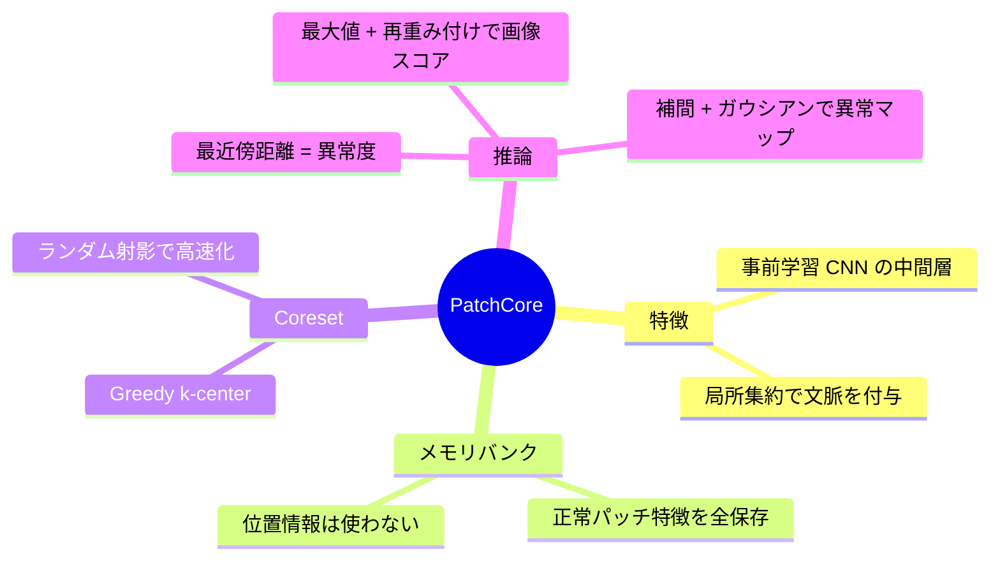

**一言でいうと**：
「正常品のパッチ辞書を作り、辞書に載っていないパッチを異常とみなす」手法。

---

## 10. 演習問題

1. **(基礎)** layer4 の特徴を使わない理由を 2 つ挙げよ。
2. **(基礎)** 入力が 224×224、正常画像が 300 枚、Coreset 比率 1% のとき、メモリバンクのパッチ数はいくつか。
3. **(考察)** ランダムサブサンプリングと Coreset サブサンプリングで、異常検知性能に差が出るのはなぜか。
4. **(基礎)** 画像スコアと異常マップは、それぞれ何を答えるか。
5. **(考察)** Coreset 比率を 1% から 10% に増やすと、メモリ量・探索時間・正常パターンのカバー範囲はどう変わるか。
6. **(発展)** 「ネジが 1 本欠けている」ような異常を PatchCore が苦手とする理由を説明し、改善策を考えよ。

<details>
<summary>解答例（講師用）</summary>

1. ① ImageNet 分類タスクに特化しすぎており汎用的なテクスチャ情報が失われる ② 空間解像度が低く（7×7）、異常位置の特定が粗くなる
2. 300 × 784 × 0.01 = **2,352** 個
3. ランダムでは出現頻度の低い正常パターンが抜け落ち、それに該当するテストパッチが「最近傍が遠い＝異常」と誤判定される。Coreset は特徴空間を均等にカバーするため、まれなパターンも残る。
4. 画像スコアは『この画像全体が異常か』を1つの数値で示す。異常マップは各位置の距離を並べ、『どこが怪しいか』を示す。
5. 保存する代表点は約10倍になり、メモリ量と最近傍探索の負担は増える。一方、まれな正常パターンまで残せる可能性が高まる。精度の改善幅はデータによる。
6. 各パッチは局所的には正常な見た目のため、どのパッチもメモリ内に近い点が存在する。対策例：大域特徴の併用、個数・配置関係をモデル化する手法（論理的異常向けの手法）との組み合わせ など。

</details>

---

## 参考文献

- K. Roth, L. Pemula, J. Zepeda, B. Schölkopf, T. Brox, P. Gehler, *"Towards Total Recall in Industrial Anomaly Detection"*, CVPR 2022.
- T. Defard et al., *"PaDiM: a Patch Distribution Modeling Framework for Anomaly Detection and Localization"*, ICPR Workshops 2020.
- N. Cohen, Y. Hoshen, *"Sub-Image Anomaly Detection with Deep Pyramid Correspondences"* (SPADE), 2020.
- P. Bergmann et al., *"MVTec AD — A Comprehensive Real-World Dataset for Unsupervised Anomaly Detection"*, CVPR 2019.
- 公式実装: https://github.com/amazon-science/patchcore-inspection
